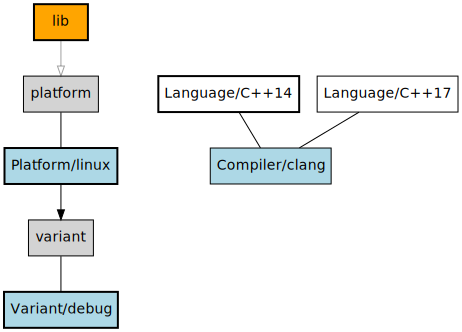

# Build::Dependency

Build::Dependency provides dependency resolution algorithms.

[](http://travis-ci.org/ioquatix/build-dependency)
[](https://codeclimate.com/github/ioquatix/build-dependency)
[](https://coveralls.io/r/ioquatix/build-dependency)

## Installation

Add this line to your application's Gemfile:

	gem 'build-dependency'

And then execute:

	$ bundle

Or install it yourself as:

	$ gem install build-dependency

## Usage

A dependency graph is a DAG (directed acyclic graph), such that if `A` depends on `B`, `A` has an edge pointing to `B`.

A dependency list is an ordered list of dependencies, such that if `A` depends on `B`, `B` will be listed earlier than `A`.

A dependency chain is the result of traversing the dependency graph from a given set of dependencies. It contains an ordered list of providers, a list of specific provisions.


A private dependency is not traversed when creating a partial chain. When building a partial chain for `app`, we don't follow `lib`'s private dependency on `Language/C++17`.



The orange box is the top level dependency, the grey box is an alias, the blue box is a specific provider, and the bold boxes are specific provisions which are being included.

### Model

To create your own dependency graph, you need to expose a model object which represents something that has dependencies and can be depended on.

Here is an example of a package model for Arch Linux `PKGBUILD` files:

```ruby
# A specific package.
class Package
	include Build::Dependency

	def initialize(path, metadata)
		@path = path
		@metadata = metadata

		metadata.each do |key, value|
			case key
			when 'pkgname'
				@name = value
			when 'depends'
				self.depends(value)
			when 'provides'
				self.provides(value)
			when 'pkgver'
				@pkgver = value
			when 'pkgrel'
				@pkgrel = value
			when 'arch'
				@arch = value
			end
		end

		@name ||= File.basename(path)
		self.provides(@name)
	end

	attr :path
	attr :name
	attr :metadata

	def package_path
		File.join(@path, package_file)
	end

	def package_file
		"#{@name}-#{@pkgver}-#{@pkgrel}-#{@arch}.pkg.tar.xz"
	end
end

# A context represents a directory full of packages.
class Context
	def initialize(path)
		@path = path
		@packages = {}

		load_packages!
	end

	def packages_path
		@path
	end

	attr :packages

	def load_packages!
		Dir.foreach(packages_path) do |package_name|
			next if package_name.start_with?('.')

			package_path = File.join(packages_path, package_name)
			next unless File.directory?(package_path)

			LOGGER.info "Loading #{package_path}..."
			output, status = Open3.capture2("makepkg", "--printsrcinfo", chdir: package_path)

			metadata = output.lines.collect(&:strip).delete_if(&:empty?).collect{|line| line.split(/\s*=\s*/, 2)}

			package = Package.new(package_path, metadata)
			@packages[package.name] = package

			if package.name != package_name
				LOGGER.warn "Package in directory #{package_name} has pkgname of #{package.name}!"
			end
		end
	end

	# Compute the dependency chain for the selection of packages.
	def provision_chain(selection)
		Build::Dependency::Chain.new(selection, @packages.values, selection)
	end
end
```

### Chains

A chain represents a list of resolved packages. You generate a chain from a list of dependencies, a list of all available packages, and a selection of packages which help to resolve ambiguities (e.g. if two packages provide the same target, selection and then priority is used to resolve the ambiguity).

Here is a rake task for the above model which can build a directory of packages including both local PKGBUILDs and upstream packages:

```ruby
desc "Build a deployment of packages, specify the root package using TARGET="
task :collect do
	target = ENV['TARGET'] or fail("Please supply TARGET=")

	LOGGER.info "Resolving packages for #{target}"

	context = Servers::Context.new(__dir__)

	chain = context.provision_chain([target])

	deploy_root = File.join(__dir__, "../deploy", target)

	FileUtils::Verbose.rm_rf deploy_root
	FileUtils::Verbose.mkdir_p deploy_root

	system_packages = Set.new

	# Depdencies that could not be resolved by our local packages must be resolved the system:
	chain.unresolved.each do |(depends, source)|
		output, status = Open3.capture2("pactree", "-lsu", depends.name)

		abort "Failed to resolve dependency tree for package #{depends.name}" unless status.success?

		system_packages += output.split(/\s+/)
	end

	# Copy system packages from pacman repositories:
	Dir.chdir(deploy_root) do
		Open3.pipeline(
			["pacman", "-Sp", *system_packages.to_a],
			['wget', '-nv', '-i', '-'],
		)
	end

	# Copy local packages:
	chain.ordered.each do |resolution|
		package = resolution.provider
		FileUtils::Verbose.cp package.package_path, File.join(deploy_root, package.package_file)
	end
end
```

# Wildcards

It's possible to include wildcards in the dependency name. This is useful if you use scoped names, e.g. `Test/*` would depend on all test targets. The wildcard matching is done by `File.fnmatch?`.

## Contributing

1. Fork it
2. Create your feature branch (`git checkout -b my-new-feature`)
3. Commit your changes (`git commit -am 'Add some feature'`)
4. Push to the branch (`git push origin my-new-feature`)
5. Create new Pull Request

## License

Released under the MIT license.

Copyright, 2017, by [Samuel G. D. Williams](http://www.codeotaku.com/samuel-williams).

Permission is hereby granted, free of charge, to any person obtaining a copy
of this software and associated documentation files (the "Software"), to deal
in the Software without restriction, including without limitation the rights
to use, copy, modify, merge, publish, distribute, sublicense, and/or sell
copies of the Software, and to permit persons to whom the Software is
furnished to do so, subject to the following conditions:

The above copyright notice and this permission notice shall be included in
all copies or substantial portions of the Software.

THE SOFTWARE IS PROVIDED "AS IS", WITHOUT WARRANTY OF ANY KIND, EXPRESS OR
IMPLIED, INCLUDING BUT NOT LIMITED TO THE WARRANTIES OF MERCHANTABILITY,
FITNESS FOR A PARTICULAR PURPOSE AND NONINFRINGEMENT. IN NO EVENT SHALL THE
AUTHORS OR COPYRIGHT HOLDERS BE LIABLE FOR ANY CLAIM, DAMAGES OR OTHER
LIABILITY, WHETHER IN AN ACTION OF CONTRACT, TORT OR OTHERWISE, ARISING FROM,
OUT OF OR IN CONNECTION WITH THE SOFTWARE OR THE USE OR OTHER DEALINGS IN
THE SOFTWARE.
